# Hi, I’m Kayalvizhi 👋

I’m **Kayalvizhi T**, an **Agentic AI & Machine Learning Engineer** building intelligent, autonomous systems and full-stack applications.

I work across **AI reasoning, data science, and scalable engineering**, using tools like **LangChain, FastAPI, React, Snowflake, and AWS** to turn ideas into production-ready systems.

🧠 **Deep Learning Focus**
I’m studying deep learning **beyond black-box usage**—deriving equations, understanding optimization dynamics, and validating assumptions mathematically to build models that are **robust, interpretable, and well-grounded**.

🔗 **Connect**

* 🌐 Portfolio: [https://kayalvizhi-tpm.lovable.app/](https://kayalvizhi-tpm.lovable.app/)
* 💼 LinkedIn: [https://www.linkedin.com/in/kayalvizhi-t](https://www.linkedin.com/in/kayalvizhi-t)

## GitHub Stats

  
  

Feel free to explore my repositories, collaborate on Agentic AI systems, or critically review my deep learning work and challenge my understanding.
